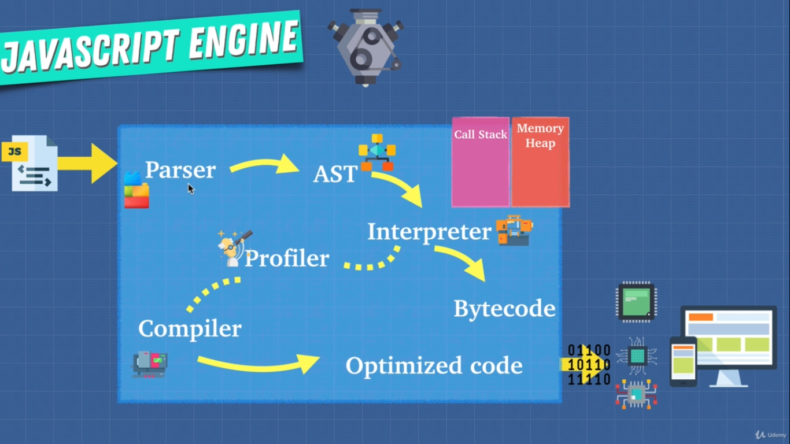

# Javascript Foundation

## Javascript Engine



- Parser
  - Parser does the lexical analysis and convert the javascript code into tokens to identify their meanings.
- AST ( Abstract Syntax Tree ) form the abstract syntax tree from the lexical tokens formed by Parser.  
[AST Explorer](https://astexplorer.net/).
- Interpreter convert the AST into bytecode and then to machine understandable understandable code.
- Profiler constantly look for the code which can be optimized and passed it to compiler.
- Compiler (JIT Compiler) optimize the code and gives us back an optimized bytecode and then the machine understandable code.

### JIT Compiler

In computing, just-in-time compilation is a way of executing computer code that involves compilation during execution of a program – at run time – rather than before execution. Most often, this consists of source code or more commonly bytecode translation to machine code, which is then executed directly.
In V8 Engine, engineers does the exactly same, they combined the features of Interpreter & Compiler for running javascript code faster.

## Bad for Optimization

In order to help the javascript engine we want to be really careful with these things.

```js
eval()
arguments // instead use parameters de structuring
for in // looping over objects/properties try to use Object.keys instead
with
delete
// Hidden classes
// Inline caching
```

In depth explanation of **Hidden Classes** and **Inline Caching** can be read from the very detailed article written by [Richard Artoul](https://github.com/richardartoul) titled as [Javascript Hidden Classes and Inline Caching in V8](https://richardartoul.github.io/jekyll/update/2015/04/26/hidden-classes.html)

## Call Stack

A call stack is a mechanism for an interpreter (like the JavaScript interpreter in a web browser) to keep track of its place in a script that calls multiple functions — what function is currently being run and what functions are called from within that function, etc.  
[MDN Web Docs - Call Stack](https://developer.mozilla.org/en-US/docs/Glossary/Call_stack)

## Memory Heap / Memory Management

Low-level languages like C, have manual memory management primitives such as malloc() and free(). In contrast, JavaScript automatically allocates memory when objects are created and frees it when they are not used anymore (garbage collection). This automation is a potential source of confusion: it can give developers the false impression that they don't need to worry about memory management.
[MDN Web Docs - Memory Management](https://developer.mozilla.org/en-US/docs/Web/JavaScript/Memory_Management)

```js
// Memory Leaks

// Avoid Global Variables as much as possible. e.g
var a = 1;
var b = 2;
```

Hypothetically if we keep adding variables, we are adding more and more pieces of memory, and if these where objects and deeply nested objects you can see the memory being used up more and more and more.

```js
// Event Listeners
var element = document.getElementById('element');
element.addEventListener('click',onClick);
```

This is the most common ways to leak memory and that is you add these event listeners and you never remove them when you don't need them so that you keep adding event listeners, and because they're just there in the background you forget about them and the next thing you know you create a memory leak, this happens a lot specially if you go back and forth between single page application

```js
// setInterval
setInterval(()=>{
    // referencing objects...
},time)
```

These objects in anonymous function of setInterval will never be collected by garbage collector because of this set interval unless we clear it and stop it.

## Single Threaded

Javascript is a single threaded language which means that only one set of instructions is executed at a time, and because of that javascript is synchronous, one thing at a time.

### Problems with the synchronous code

Imagine we are using twitter, it has many features we can tweet, we can see others tweet, notifications, messages and many more.

Imagine if they had a function that had let's say a really big loop which takes few seconds to complete. When that happens if we just use the javascript engine you wouldn't be able to perform any other actions. Classical example of this is a javascript alert

```js
alert('Let me freeze your application.')
```

On the call stack we have function, that's running and we can't do anything until the call stack is empty.
When we use javascript, we don't just only use javascript engine.

### Javascript Runtime

As mentioned javascript is a single threaded programming language, It has only one Call Stack & Memory Heap, if any other program want's to execute it has to wait until the previous program or function is completely executed. This is where javascript runtime comes in. In this case the web browser is working in the background while the synchronous code is running and it's using something called the **Web API** or the **Web Browser API** to communicate and let the JS Engine know, Hey i am back with some data or some work you told me to do in the background. Web API comes with the browsers like Chrome, Firefox, Edge, Safari and others. These Web APIs can do variety of things like send HTTP requests, listen to DOM events, delay execution, it can even be used for caching or database storage on the browser.  
The browsers actually underneath the hood use low level programming languages like C++ to perform these operations in the background. These Web API are asynchronous. You can instruct these APIs to do something in the background and return data once it's done. Meanwhile we can just continue working on our javascript call stack and execute functions.


Let's understand the picture of Javascript Runtime  
As soon as something comes up like set timeout or any other async code which isn't a part of call stack, call stack forward these operations to Web API, Web API then perform it's tasks such as setTimeout, making long running http requests or retrieving data from database, once the Web API is done with it's work, it then forward the result of the completed task to Callback Queue. Event loop will continuously check the status of Call Stack and Callback Queue, if the Event loop sees a task in a Callback Queue and the Call Stack is empty it then push the task from Callback Queue to Call Stack. Let's see how it works practically.

```js
console.log('1');
setTimeout(() => { console.log('2') },1000);
console.log('3');
// Output
1
3
2
```

Let's explain what happened above.

- We pushed console.log('1') on to the Call Stack, we get our output and then it gets popped out from the Call Stack.
- We pushed setTimeout on to the Call Stack, Javascript Engine forwarded the setTimeout function to the Web API since it's task of Web API, and setTimeout popped out from the Call Stack.
- We pushed console.log('2') on to the Call Stack, we get our output and then it gets popped out from the Call Stack.
- After 1 second Web API informed the Callback Queue and moved the data to Callback Queue
- Event loop is constantly checking for the data in Callback Queue and status of Call Stack, If the Call Stack is empty and Callback Queue has the data it then moved the data from Callback Queue to Callback Stack, Call Stack executed the data and we gets our result.

Check out this [amazing tool](http://latentflip.com/loupe/) by Philip Roberts to actually visualize this process.

Let's look at another example

```js
console.log('1');
setTimeout(() => { console.log('2') },0); // notice that we have set 0 second timer
console.log('3');
// Output
1
3
2
```

Although we set the 0 second timer but we still gets the same output as before, the reason is no matter how many seconds timer you have set, it still has to go through the process of passing it to Web API from Call Stack, then to Callback Queue from Web API and then finally from Callback Queue to Call Stack by event loop.  
**Remember even if you have a job in a Callback Queue but the Call Stack is not empty it has to wait until the Call Stack is empty**.  

## NodeJS

NodeJS is javascript runtime built on Chrome's V8 JavaScript Engine.


### Source

This article is compiled from the popular video series course by [Andrei Neagoie](https://www.udemy.com/user/andrei-neagoie/) on Udemy titled as [JavaScript: The Advanced Concepts](https://www.udemy.com/course/advanced-javascript-concepts/). If you want to learn more and dive deeper into the course i would highly recommend you to watch this complete course.
