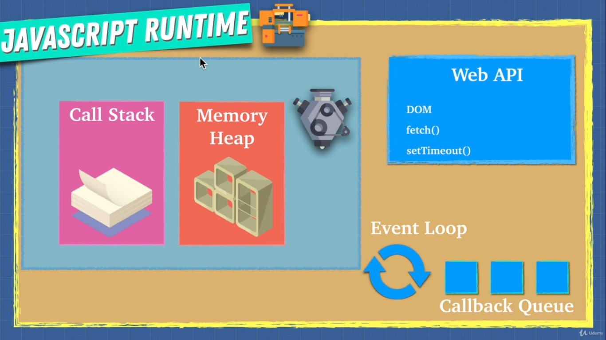

# Javascript Foundation

## Javascript Engine


- Parser
  - Parser does the lexical anaylysis and convert the javascript code into tokens to identify their meanings.
- AST ( Abstract Syntax Tree ) form the abstract syntax tree from the lexical tokens formed by Parser.  
[AST Explorer](https://astexplorer.net/).
- Interpreter convert the AST into bytecode and then to machine understandable understandable code.
- Profiler constantly look for the code which can be optimized and passed it to compiler.
- Compiler (JIT Compiler) optimize the code and gives us back an optimized bytecode and then the machine understandable code.

### JIT Compiler

In computing, just-in-time compilation is a way of executing computer code that involves compilation during execution of a program – at run time – rather than before execution. Most often, this consists of source code or more commonly bytecode translation to machine code, which is then executed directly.
In V8 Engine, engineers does the exactly same, they combined the features of Interpeter & Compiler for running javascript code faster.

## Bad for Optimization

In order to help the javascript engine we want to be really carefull with these things.

```js
eval()
arguments // instead use paramters de structing
for in // looping over objects/properties try to use Object.keys instead
with
delete
// Hidden classes
// Inline caching
```

In depth explanation of **Hidden Classes** and **Inline Caching** can be read from the very detailed article written by [Richard Artoul](https://github.com/richardartoul) titled as [Javascript Hidden Classes and Inline Caching in V8](https://richardartoul.github.io/jekyll/update/2015/04/26/hidden-classes.html)

## Call Stack

A call stack is a mechanism for an interpreter (like the JavaScript interpreter in a web browser) to keep track of its place in a script that calls multiple functions — what function is currently being run and what functions are called from within that function, etc.  
[MDN Web Docs - Call Stack](https://developer.mozilla.org/en-US/docs/Glossary/Call_stack)

## Memory Heap / Memory Managment

Low-level languages like C, have manual memory management primitives such as malloc() and free(). In contrast, JavaScript automatically allocates memory when objects are created and frees it when they are not used anymore (garbage collection). This automaticity is a potential source of confusion: it can give developers the false impression that they don't need to worry about memory management.
[MDN Web Docs - Memory Management](https://developer.mozilla.org/en-US/docs/Web/JavaScript/Memory_Management)

```js
// Memory Leaks

// Avoid Global Variables as much as possible. e.g
var a = 1;
var b = 2;
/*
Hypothetically if we keep adding variables, we are adding more and more peieces of memory, and if these where objects and deeply nested objects you can see the memory being used up more and more and more.
*/

// Event Listeners
var element = document.getElementById('element');
element.addEventListener('click',onClick);
/*
This is the most common ways to leak memory and that is you add these event listeners and you never remove them when you don't need them so that you keep adding event listeners, and because they're just there in the background you forget about them and the next thing you know you create a memory leak, this happens a lot specially if you go back and forth between single page application
*/

// setInterval
setInterval(()=>{
    // referencing objects...
    /*
    These objects in here will never be collected by garbage collector because of this set interval unless we clear it and stop it.
    */
},time)
```

## Single Threaded

Javascript is a single threaded langugage which means that only one set of instructions is executed at a time, and because of that javascript is synchronous, one thing at a time.

### Problems with the synchronous code

Imagine we are using twitter, it has many features we can tweet, we can see others tweet, notifications, messages and many more.

Imagine if they had a function that had let's say a really big loop which takes few seconds to complete. When that happens if we just use the javascript engine you wouldn't be able to perform any other actions. Classical example of this is a javascipt alert

```js
alert('Let me freeze your application.')
```

On the call stack we have function, that's running and we can't do anything untill the call stack is empty.
When we use javascript, we don't just only use javascript engine.

### Javascript Runtime


